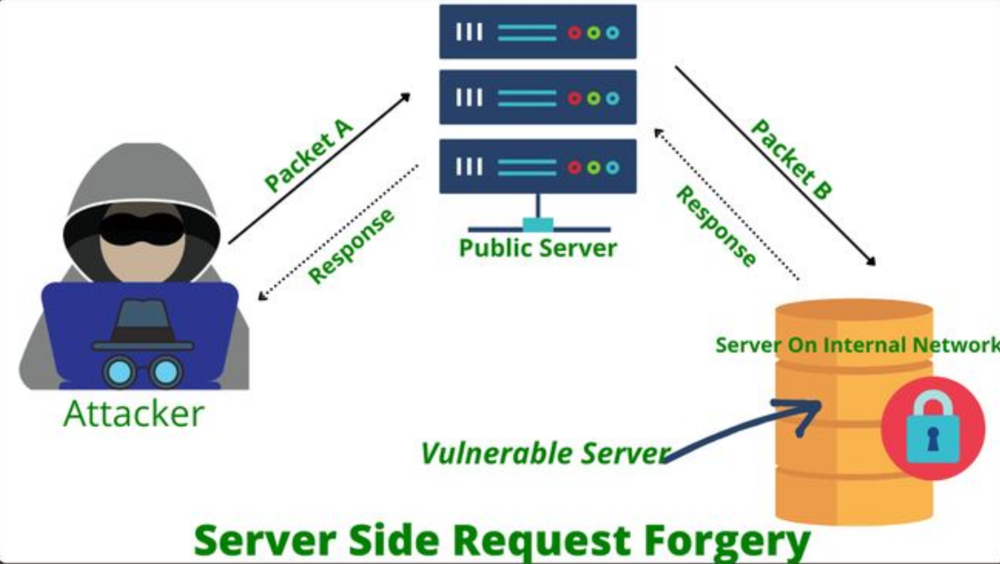

## Qu'est ce qu'une SSRF ?

### Introduction

La [SSRF](https://owasp.org/Top10/A10_2021-Server-Side_Request_Forgery_%28SSRF%29/) est une des nouvelles vulnérabilité de l'OWASP Top 10, elle a été ajoutée en 2021 et n'est pas du tout à négliger. Elle est qctuellement [10ᵉ du top 10 OWASP](https://owasp.org/Top10/fr/) mais risque de monter prochainement en "popularité" au vu de sa nouveauté et de sa subtilité contrairement à des vulnérabilités comme la [XSS](01-XSS.md) ou la SQLi qui sont connues depuis longtemps et qui sont plus facilement détectables.

#### les différents types de SSRF
!!!TODO TODO !!! 

### Quelques chiffres sur la SSRF

Voici les facteurs donné par l'owasp :

|CWEs Mapped |	Max Incidence Rate |	Avg Incidence Rate |	Avg Weighted Exploit |	Avg Weighted Impact |	Max Coverage |	Avg Coverage |	Total Occurrences 	| Total CVEs
|--------|-----------|---------------------|----------------------|---------------------|------------------|------------------|---------------------|---------------------|
| 1 |	2.72% |	2.72% |	8.28 |	6.72 |	67.72% |	67.72% |	9,503 |	385

En 2022 c'est plus de 100 000 business qui ont éte impacté par cette vulnérabilité.

la plateforme microsoft Exchange était vulnérable via une SSRF et a été exploitée par des attaquants pour réaliser une RCE (Remote Code Execution) sur les serveurs Exchange et deployer un ransomware.
cela a donné lieu a 2 CVEs :
- CVE-2022-41040, avec un score CVSS de 8.8 pour la SSRF 
- CVE-2022-41082, avec un score CVSS de 8.0 pour la RCE 

### Qu'est ce qu'une SSRF ?

Mais du coup qu'est ce qu'une SSRF ? 

Une SSRF est une vulnérabilité qui permet à un attaquant de forger des requêtes HTTP depuis le serveur vulnérable vers des ressources internes ou externes.
Le danger de cette vulnérabilité réside dans le fait aue le serveru lui même va executer la requête. Cela peut mener à une exposition de ressources internes, à une exfiltration de données, une RCE, du port scanning, du dénis de service, etc...

### Comment fonctionne une SSRF ?

!!!TODO TODO !!! 

## Exemple d'une SSRF

!!!TODO TODO !!! 

## Comment se protéger d'une SSRF ?

!!!TODO TODO !!! 

## exemple de payloads 

!!!TODO TODO !!! 

## Ressources 

Voici une liste de ressources pour aller plus loin sur le sujet :

- [OWASP SSRF](https://owasp.org/Top10/A10_2021-Server-Side_Request_Forgery_%28SSRF%29/)
- [Portswigger](https://portswigger.net/web-security/ssrf)
- [TP portswigger](https://portswigger.net/web-security/ssrf/lab-basic-ssrf-against-localhost)
- [portswigger news SSRF](https://portswigger.net/daily-swig/ssrf)
- [SSRF bible](https://cheatsheetseries.owasp.org/assets/Server_Side_Request_Forgery_Prevention_Cheat_Sheet_SSRF_Bible.pdf)

- Un [repo github](https://github.com/MonsieurCo/A10-2021-SSRF-OWASP-TOP10) réalisé pendant nos études sur lequel je me suis appuyé pour ecrire cet article. Il dispose d'une démonstration d'un serveur web avec une page contenant une SSRF ainsi que d'un serveur caché dans le réseau local du docker qui sera rednu visible avec l'exploit de la faille.