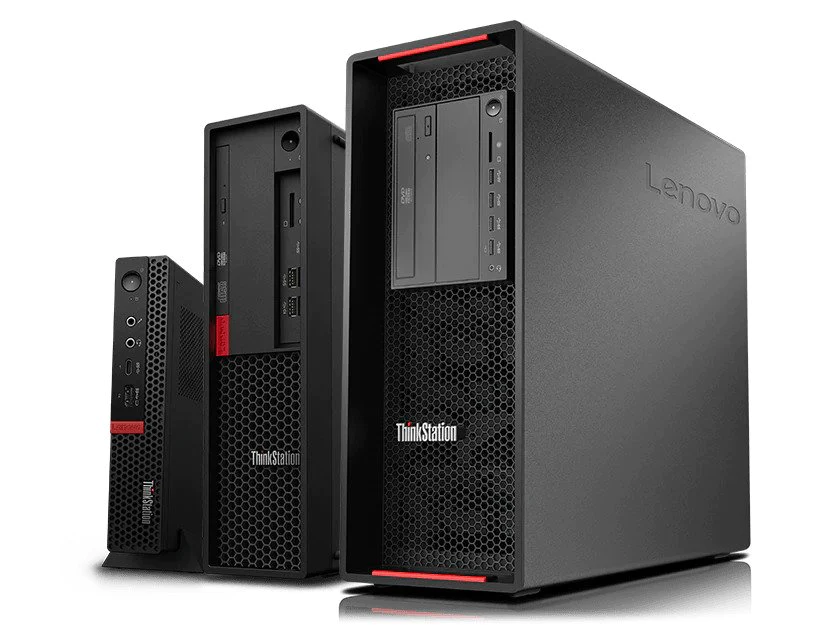

# Trouver une machine

Choisir une machine, c'est tout un art !

Vos services vont devoir tourner sur votre propre serveur, c'est donc là que vous devrez faire ce que font traditionellement les hébergeurs cloud pour vous : choisir le *hardware* sur lequel vont tourner tout ce que vous souhaitez héberger.

Démystifions quelque chose d'assez répandu : un serveur, c'est un ordinateur comme les autres ! Il fonctionne comme n'importe quel autre ordinateur. Il a juste un hardware qui lui permet de résister un peu mieux aux pannes. Un ordinateur personnel **peut** être un serveur !

Passons en revue les différentes options qui peuvent s'offrir à vous si vous souhaitez faire de l'auto-hébergement...

## Configuration recommandée pour un serveur "classique"

Cette configuration vous permettra de streamer des séries stockées au préalable, faire tourner des serveurs Minecraft, un serveur Web et autre joyeusetés (bloqueur de pub par exemple).

| Matériel          | Recommandations minimales                 |
|-------------------|-------------------------------------------|
| CPU               | i7 4e Gen / i5 8e Gen                     |
| GPU               | Aucun                                     |
| RAM               | 8 Go (16 pour un serveur Minecraft moddé) |
| Disque (OS)       | Pour l'OS : 256 Go de SSD                 |
| Disque (Stockage) | 4 To Minimum                              |

:::warning A propos du stockage
Certaines machines ne proposent qu'un seul emplacement de disque.
Il vous sera donc impossible d'avoir deux disques de stockage.
*Pour le SSD, il se cale un peu n'importe où, vu qu'il ne tourne pas.*
:::

## Vous avez déjà un ordinateur

L'ordinateur le moins cher, c'est celui que l'on a déjà sous la main : le vieux PC bureautique poussiéreux de mamie, un ancien pc portable sur lequel vous jouiez quand vous étiez au collège, un vieux coucou qui trainait au travail... Toutes ces machines peuvent devenir un serveur plus que capable.

Concrètement, si l'ordinateur en question est sorti dans les 20 dernières années, on devrait pouvoir le transformer en serveur.

Un processeur Intel i3/i5/i7 sera capable de faire tourner votre serveur, même si c'est une génération très ancienne. Pour la RAM, à moins que votre ordinateur possède moins de 512 Mo de RAM, vous pouvez faire tourner un serveur dessus.

## Vous n'avez pas d'ordinateur

Le meilleur moyen d'avoir un serveur qui envoie du paté pour pas cher, c'est d'acheter un ordinateur d'occasion ! Nous vous recommandons des ordinateurs bureautique. Ils sont peu chers car disponibles en très grande quantité, solides (ce sont des ordinateurs pour pro après tout) et bien assez puissant pour bon nombre d'applications.

Nous vous conseillons uniquement deux sites pour pouvoir acheter vos machines :

- [BackMarket](https://www.backmarket.fr/fr-fr) est un site Français, qui propose uniquement des machines d'occasion. Vous pourrez y trouver votre bonheur, parfois à moins de 100€ suivant vos besoins ! La livraison est relativement rapide (moins d'une semaine généralement), et les machines arrivent en un seul morceau.

- [eBay](https://www.ebay.fr/) vous permettra de trouver beaucoup de machines reconditionnées, pour la plupart expédiées d'Allemagne. Les prix peuvent potentiellement être plus compétitifs que BackMarket si vous avez la patience pour trouver le bon deal.

:::tip Frais de douanes
Pour éviter les frais de douane, ne commandez que chez des fournisseurs qui expédient depuis l'Union Européenne (le Royaume-Uni ne compte pas).
:::

## Les erreurs à ne pas faire 

### Avoir un serveur trop gourmand

Il peut être tentant de prendre une grosse machine et ainsi pouvoir infliger n'importe quelle charge à sa machine sans trop savoir ce qu'on va faire avec.

Il est conseillé de ne pas avoir les yeux plus gros que le ventre. Si vous ne savez pas trop ce que vous allez faire de votre serveur, 500GB de stockage suffisent, ainsi qu'un i5 (ou i3 récent) et 8/16 Go de RAM.

En prenant un serveur trop gourmand, vous allez augmenter le prix de votre facture d'électricité pour de la puissance de calcul inutilisée. Il vous sera plus facile d'acheter une deuxième machine au cas où et de transférer vos services, en gardant votre première machine pour certains services, ou pour un membre de votre famille !

:::danger Prendre un serveur trop petit
Il est évidemment un gâchis d'argent d'acheter un serveur qui ne pourra faire tourner AUCUN de vos services. Du moment que vous investissez dans une machine à plus de 70 euros vous ne devriez pas avoir ce genre de problème. N'achetez pas de serveur en dessous de 50 euros, il ne vous sera probablement pas utile.
:::

### Avoir un serveur trop petit

*On parle ici des dimensions du serveur.*

Si vous prévoyez de rajouter du stockage en plus du disque dur qui sera (peut-être) fourni avec votre machine, faites bien attention à avoir la place dedans !

De manière générale, les PCs au format petite tour peuvent accueillir un disque dur supplémentaire. Concrètement, si le PC est plus petit ou fait la taille de votre box, vous pouvez être sûr qu'il est impossible d'ajouter un deuxième disque dur.

### Problèmes de connexion

Connectez votre serveur en Ethernet à votre box, il aura ainsi une bien meilleur connexion par rapport à une connection Wi-Fi, surtout si la puce Wi-Fi en question est connectée en USB à votre serveur !

De plus, il est intéressant de regarder la vitesse maximale du port Ethernet de votre serveur pour voir si il bridera vos téléchargements / envois de fichiers. Par exemple, certaines machines plutôt ancienne n'ont qu'un port 100 Mbps, ce qui est plus bas que ce qu'une box fibre FTTH peut vous offrir.

### Avoir un HDD pour installer son OS

Un HDD vous coûtera quelques euros de moins qu'un SSD, mais pour un volume de 236 ou 512 GB cela reste négligeable vis-à-vis du coût du serveur. On vous conseille d'en prendre un, notamment pour avoir des mises à jour de paquets plus rapide, un serveur dispo plus rapidement lors d'un reboot, et certains services gourmands qui démarreront plus rapidement.

## Les machines d'occasion à rechercher

Voici quelques machines qu'il peut être intéressant de chercher. On ne va pas vraiment rajouter de description, elles font toutes un peu la même chose, ont plus ou moins la même capacité de refroidissement et les mêmes pièces.

*La série Optiplex de Dell.*
[Trouver sur BackMarket](https://www.backmarket.fr/fr-fr/search?q=optiplex)

*La série ThinkStation / ThinkCenter de Lenovo.*
[Trouver sur BackMarket](https://www.backmarket.fr/fr-fr/l/unite-centrale-reconditionnee/52751b87-5a52-4180-a05f-eceee9971a5a#brand=99%20Lenovo)

*La série WorkStation Z de HP.*
[Trouver sur eBay](https://www.ebay.fr/sch/i.html?_nkw=workstation+Z&_sacat=0)