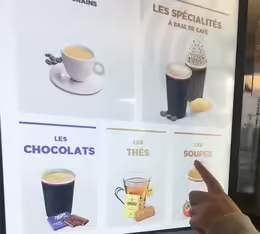
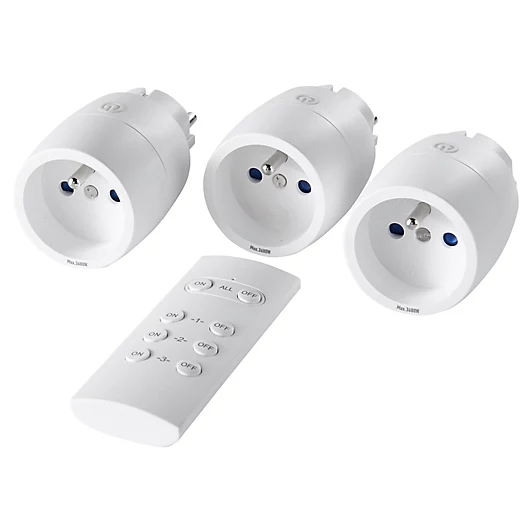

Vous êtes un grand consommateur de sucreries ou de boissons énergisantes, nécessaire pour vous maintenir éveillé après de longues soirées sur LOL ? Vous avez peur de dilapider le chèque de papy dans les distributeurs hors de prix de Polytech ? Alors ce tutoriel est fait pour vous !

# Les machines à café

Les machines à café du campus de Polytech sont toutes fournies par la même entreprise, MaxiCoffee. Ces distributeurs proposent une large gamme de boissons, comprises dans une certaine fourchette de prix. Il est possible de payer ses consommations avec sa carte étudiant ou bien sa carte bancaire.
En s'y prenant correctement, grâce à un bug logiciel, il est possible d'avoir __n'importe quel boisson au prix minimum de la gamme__ !

### Comment faire ?

1. Commencez par vous munir de votre moyen de paiement (carte étudiant, CB), dans la main gauche
2. Sur l'écran de la machine, sélectionnez la boisson la moins chère, __mais ne la payez pas__ !
3. Lorsque l'écran de paiement s'affiche, appuyez de manière continue sur le bouton d'annulation, jusqu'à entendre une tonalité sonore
4. Attendez que l'écran se réinitialise à l'accueil, et préparez votre carte de paiement
5. De retour sur l'écran d'accueil, sélectionnez très rapidement la boisson que vous souhaitez
6. Payez la le plus rapidement possible, le boîtier de paiement sera alors désynchronisé du distributeur
7. Savourez votre boisson en pensant que vous venez d'arnaquer le système, alors que vous l'avez toujours payée 10 fois trop chère !

# Les distributeurs de nourriture

Obtenir gratuitement de la nourriture dans ces distributeurs nécessite cette fois-ci un minimum d'investissement. Vous devrez acheter une prise électrique télécommandée, et brancher discrètement le distributeur à celle-ci.

Il faudra impérativement __payer par carte bancaire, et non par carte étudiant__ ! Le protocole de paiement par carte bancaire fonctionne en 3 temps:
1. Le marchand interroge votre banque, pour savoir si votre compte est solvable
2. En cas de réponse positive, le marchand accepte la vente
3. Quelques jours plus tard, votre compte est effectivement débité de la somme

Pour obtenir votre barre chocolatée préférée gratuitement, vous devez donc la payer normalement avec votre carte bancaire. A ce moment là, le produit commencera à tomber avec la vis sans fin.

Lorsque le produit s'apprête à tomber, __coupez le courant de la machine__, à l'aide de la prise. La machine n'aura pas vu le produit tomber (grâce à des capteurs laser), et ne confirmera pas le paiement. __Votre compte ne sera donc jamais débité__ !