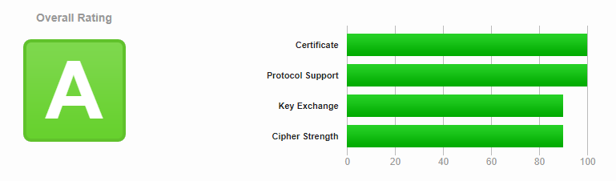

[Caddy](https://caddyserver.com/) est un serveur web disponible sur toutes les distributions Linux, qui propose plusieurs avantages par rapport à des alternatives comme [Nginx](https://www.nginx.com/) ou [Apache](https://httpd.apache.org/).

Voilà une configuration tout à fait lambda, que l'on va décortiquer ensemble.
Cette configuration vous permettra de rendre public un dossier sur votre serveur pour pouvoir y télécharger des fichiers, ainsi qu'une instance Portainer que vous pouvez trouver dans la page dédiée à [Docker](./07-docker.md).

*Notez que le fichier de configuration par défaut pour Caddy est dans `/etc/caddy/Caddyfile`.*

```
files.example.net {
        root * /chemin/des/fichiers
        file_server browse
}

portainer.example.net {
        reverse_proxy https://localhost:9443  {
                transport http {
                        tls_insecure_skip_verify
                }
        }
}
```

Dans les fichiers Caddyfile, vous n'avez pas besoin de mentionner l'adresse IP ou le port sur lequel vous allez écouter les requêtes entrantes. À la place, vous pouvez simplement indiquer le nom de domaine (ou le sous-domaine) qui va fournir un service.

Donc au lieu d'avoir un `192.168.1.12:80` on a les mentions de `files.example.net` et de `portainer.example.net`.

Faire ça nous permet d'aller chercher un certificat TLS automatiquement, avec toute la configuration qui va bien :

- Uniquement TLS 1.2 & 1.3
- Certificat valide
- Redirection HTTPS automatique

Cette configuration nous permet d'atteindre la note de A sur [SSL Labs](https://www.ssllabs.com/ssltest/index.html) :



```
root * /chemin/des/fichiers
        file_server browse
```

Cette partie de la configuration nous permet de créer un explorateur de fichiers interactif dans le dossier que l'on a indiqué. Il est important de noter que sans le mot-clé `browse` le serveur pourra servir les fichiers mais sans l'explorateur, ce qui est intéressant si vous souhaitez servir un site static avec un `index.html` par exemple.

```
reverse_proxy https://localhost:9443  {
                transport http {
                        tls_insecure_skip_verify
                }
        }
```

Cette deuxième partie se connecte à notre container `portainer` qui tourne en écoutant sur le port 9443. En ajoutant la partie `transport http` on peut ignorer le fait que le certificat TLS du backend soit un certificat auto-signé.

Grâce à cette configuration, notre serveur affichera deux pages complètement différentes alors que les deux services sont hébergés physiquement sur la même machine ! Pratique non ?