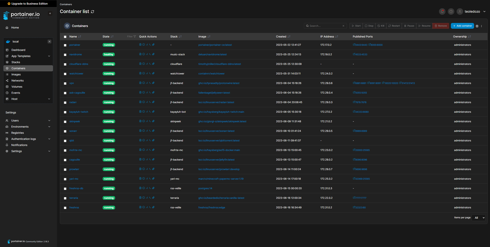

Installer des applications à la main, c'est le piège que font beaucoup de nouveaux administrateurs à la maison. C'est tellement plus rapide pour avoir un service qui tourne sur sa machine sans trop se poser de questions et il n'y a pas besoin d'apprendre une nouvelle techno pour le faire.

Sauf que sur le long terme, faire les mises à jour de son service ou gérer ses services en deux clics fait gagner énormément de temps.

Il est donc **fortement** recommandé que vous appreniez Docker. Certaines solutions sont designées prioritairement pour tourner sous Docker, et vous en passez va devenir de plus en plus compliqué quand vous allez essayer de déployer de plus en plus de services sur votre machine.

Au passage, si vous souhaitez déployer un service sur votre serveur, prenez le temps de voir si il est supporté par [Linuxserver.io](https://fleet.linuxserver.io/) qui maintient des images Docker pour énormément de projets !

## C'est quoi Docker ?

Docker, ça permet d'encapsuler une application avec toutes ses dépendances :
- Le système d'exploitation 
- Les paquets nécessaires
- L'application en elle-même

L'avantage, c'est que c'est beaucoup + light que d'utiliser des machines virtuelles, tout en étant extra flexible.

Cela arrange aussi énormément les développeurs de services qui peuvent fournir un seul paquet Docker et être sûrs qu'il tournera sans problème peut importe l'OS qui fait tourner le container. C'est d'ailleurs pour cela qu'il est préférable que vous utilisiez Docker : car c'est le format qui reçoit le plus d'attention de la part des développeurs la plupart du temps.

## Portainer : une interface Web pour Docker

[Portainer](https://www.portainer.io/) est une interface Web qui permet de gérer ses containers et ses stacks faites avec `docker compose` facilement, ce qui aide énormément quand il faut déployer des services.



Pour l'installer, vous pouvez utiliser la commande ci-dessous.

```bash
docker volume create portainer_data
docker run -d -p 8000:8000 -p 9443:9443 --name portainer --restart=always -v /var/run/docker.sock:/var/run/docker.sock -v portainer_data:/data portainer/portainer-ce:latest
```

## Et `docker compose` ?

Concrètement, `docker compose` permet deux choses :

- Sauvegarder une longue commande Docker
- Déployer plusieurs containers qui partagent le même réseau virtuel

Par exemple, ce fichier YAML permet de faire tourner une application NodeJS avec la base de données MongoDB nécessaire : 

```yaml
version: '3'
services:
  app:
    image: node:latest
    container_name: app_main
    restart: always
    command: sh -c "yarn install && yarn start"
    ports:
      - 8000:8000
    working_dir: /app
    volumes:
      - ./:/app
    environment:
      MYSQL_HOST: localhost
      MYSQL_USER: root
      MYSQL_PASSWORD: 
      MYSQL_DB: test
  mongo:
    image: mongo
    container_name: app_mongo
    restart: always
    ports:
      - 27017:27017
    volumes:
      - ~/mongo:/data/db
volumes:
  mongodb:
```

## Les MAJs Docker avec Watchtower

Watchtower est un outil permettant de mettre à jour automatiquement vos containers Docker. Le système de tag de Docker est pratique, mais uniquement si vous utilisez des mises à jours automatiques.

Par exemple, un container qui utilise le tag `latest` ne sera pas mis à jour automatiquement pour correspondre à la dernière version en date.

:::tip
Cela vaut aussi pour les autres tags, pas uniquement `latest`.
:::

Vous téléchargez le container une fois et le déployez, mais si une nouvelle version sort pour corriger une faille de sécurité majeure, vous devrez tout faire vous même, et ça peut devenir compliqué quand vous avez plusieurs dizaines de containers qui tournent sur votre machine.

Watchtower nous permet de régler le problème et de mettre à jour tous nos containers en un claquement de doigts. Il suffit juste de l'installer avec le fichier `docker compose` suivant :

```yaml
version: "3"
services:
  watchtower:
    container_name: watchtower
    image: containrrr/watchtower
    volumes:
      - /var/run/docker.sock:/var/run/docker.sock
    restart: unless-stopped
    environment:
      - WATCHTOWER_POLL_INTERVAL=3600 #Pour vérifier les mises à jour à toutes les heures
```