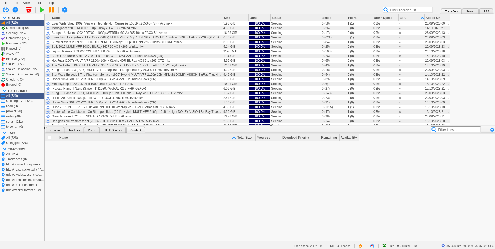
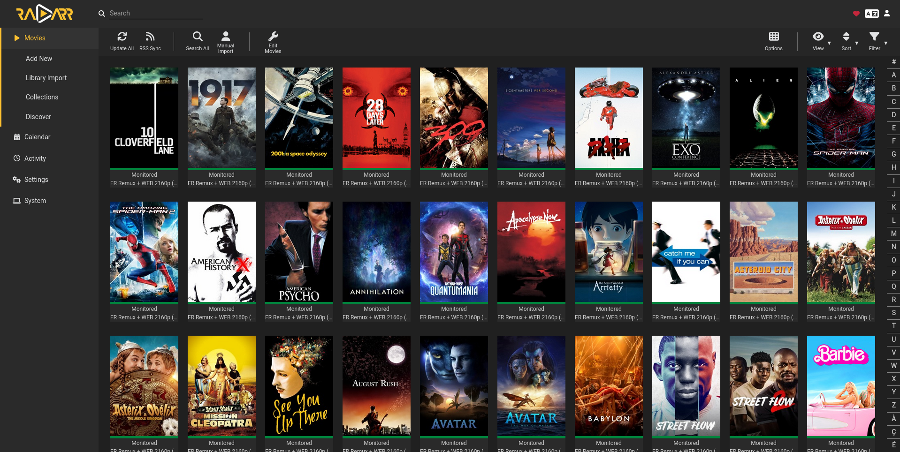

Netflix, c'est bien mais c'est cher !

On peut faire beaucoup mieux avec quelques containers et un serveur avec un peu de stockage ! Un serveur où l'on pourrait avoir n'importe quelle série, où votre maman pourrait demander un film en cliquant sur un bouton et l'avoir quelques minutes plus tard.

## Matériel

Tout ces logiciels, ça pompe des ressources, alors voilà ce qu'il va vous falloir pour réussir à héberger tout ça.

### Disque dur

Il va vous falloir un **GROS** disque.

Concrètement, si vous en avez un qui traine et qui ne sers à rien ça peut dépanner, mais on dépasse assez vite le stade du premier téraoctet quand on a quelques utilisateurs et qu'ils veulent commencer à vraiment se passer de Netflix.

Perso, nous avons tous un disque dur de + de 10 To et on arrive à s'en sortir, mais en dessous ça devient compliqué et il faudra faire pas mal de ménage.

Cela veut souvent dire remplacer des épisodes pour des versions + light, quitte à perdre en qualité vidéo, ou pire, supprimer du contenu de votre serveur.

### CPU / GPU

Le problème avec la vidéo, c'est que l'information peut être encodée de plein de manières différentes : H264, H265, AV1, VP9... 

Le plus embêtant, c'est que certaines machines ne parlent pas toutes le même "langage" de codec. C'est à ce moment-là que votre serveur va devoir faire la traduction (transcoding). Le problème, c'est qu'on parle de décoder et ré-encoder une vidéo à la volée, donc ça pompe pas mal de puissance de calcul.

Autant vous le dire tout de suite, si vous avez un raspberry Pi, vous pouvez oublier l'idée de faire du transcoding. Priez pour que vos utilisateurs se connectent depuis des clients compatibles.

Pour les autres, un CPU fait très bien l'affaire quand vous avez 3 ou 4 utilisateurs en même temps sur votre machine. Par contre, vous allez devoir vous préparer à avoir des bruits de jet privé émanant de votre serveur à 3H du mat' quand votre pote chômeur ira se mater GoT en 4K.

Si vous voulez avoir un peu plus de jus pour servir plus de clients en simultané, ou si vous ne voulez plus de bruit de jet privé à 3H du mat' il y a une solution simple : incorporer une carte graphique dans votre serveur pour que Jellyfin puisse l'utiliser.

Pour avoir plus d'infos sur ce sujet, vous pouvez [consulter la doc de Jellyfin](https://jellyfin.org/docs/general/administration/hardware-acceleration/).

Il est fortement recommandé de prendre une carte graphique Intel Arc A380, pour les raisons suivantes :
- Des drivers intégrés au kernel Linux ce qui permet de ne pas se prendre la tête avec leur installation
- Un support du AV1, ce qui permettra à vos utilisateurs de regarder leur contenu depuis un navigateur
- Un prix bas par rapport aux autres cartes graphiques avec le même set de codecs
- Une consommation électrique faible qui permet de ne pas avoir besoin d'alim externe

### Bande Passante

Tout dépend le nombre de personnes qui regardent du contenu en même temps sur votre instance. On vous conseille de tabler sur 10 Mbps par stream *minimum*. Si jamais vous avez 30 Mbps d'upload avec votre abonnement Internet, vous ne pourrez donc pas envoyer + de 3 streams à la fois.

Du moment que vous avez un minimum d'upload, la question n'est pas de savoir si vous pourrez regarder des films, mais surtout avec combien de personnes vous pourrez partager votre instance.

## Logiciels

La stack complète utilisée pour gérer vos films est assez complexe et se compose de pas mal de services différents. Il est donc fortement recommandé de lire la partie du Wiki sur la configuration d'un [reverse proxy](../40-selfhost/05-caddy.md) et de [Docker](../40-selfhost/07-docker.md) avant de commencer si vous n'êtes pas à l'aise avec ces sujets.

:::tip
Il est assez complexe de bien configurer tous ces services, il est recommandé de lire le wiki [TRaSH Guides](https://trash-guides.info/) afin d'avoir plus d'informations sur comment configurer les différents logiciels ci-dessous.
:::

### qBitTorrent & VPN



qBitTorrent est un client BitTorrent open-source et disponible sur toutes les plateformes. Il est très complet, et offre une interface Web qui permet de le configurer en profondeur et de gérer vos torrents sans souci.
Il existe d'autres alternatives, mais elles sont toutes assez limitées, c'est pourquoi tout le monde chez nous utilise qBit.

Afin d'éviter de se faire taper sur les doigts par notre ami l'ARCOM, il va vous falloir un VPN, idéalement un VPN qui pointe vers un autre pays.
Si vous avez déjà un abonnement VPN, il va vous falloir trouver une image Docker pour pouvoir vous y connecter car le but de ce VPN est de cacher notre traffic BitTorrent.

À des fins d'illustrations, vous trouverez donc un exemple de configuration de qBitTorrent et Proton VPN dans un seul et même fichier `docker-compose` ci-dessous.

```yaml
---
version: "3.8"
services:
  protonwire:
    container_name: vpn
    image: ghcr.io/tprasadtp/protonvpn:latest
    init: true
    restart: unless-stopped
    privileged: true
    environment:
      PROTONVPN_SERVER: EX#99
      WIREGUARD_PRIVATE_KEY: "CLÉ_PRIVÉE_WIREGUARD"
    # NET_ADMIN capability is mandatory!
    cap_add:
      - NET_ADMIN
    # sysctl net.ipv4.conf.all.rp_filter is mandatory!
    sysctls:
      net.ipv4.conf.all.rp_filter: 2
      net.ipv6.conf.all.disable_ipv6: 1
    volumes:
      - /etc/localtime:/etc/localtime:ro
    ports:
      - 127.0.0.1:6881:6881
      - 127.0.0.1:6881:6881/udp
      - 127.0.0.1:10020:10020
      - 127.0.0.1:9091:9091
      - 127.0.0.1:51413:51413
      - 127.0.0.1:51413:51413/udp
    devices:
      - /dev/net/tun:/dev/net/tun
    
  qbittorrent:
    image: lscr.io/linuxserver/qbittorrent:latest
    container_name: qbit
    depends_on:
      - protonwire
    userns_mode: host
    network_mode: service:protonwire
    restart: unless-stopped
    environment:
      - PUID=0
      - PGID=0
      - TZ=Europe/Paris
      - WEBUI_PORT=10020
    volumes:
      - /containers/qbittorrent:/config:z
      - stockage:/stockage:z
```

:::info
Il n'est pas nécessaire de cacher le reste de votre traffic. La lecture de contenu depuis votre instance Jellyfin n'est pas vulnérable.
:::

### Sonarr & Radarr



Sonarr et Radarr ont la même fonction : vous offrir une interface Web pour réussir à gérer vos différents contenus en lançant un téléchargement automatique pour un épisode de série, ou pour remplacer un film par une copie de meilleure qualité. Sonarr fonctionne pour les séries (et animes) et Radarr pour les films.

Ces logiciels vont aller s'interfacer directement avec qBitTorrent et les différents indexeurs BitTorrents que vous avez renseigné pour vous permettre d'avoir une liste de tous les torrents disponibles pour une oeuvre, pour ensuite pouvoir l'ajouter à qBit en un clic, ce sont donc des logiciels dont vous ne pourrez plus vous passer une fois que votre bibliothèque commencera à faire plus de quelques dizaines de giga-octets.

Voici un exemple de fichier `docker-compose` adapté : 

:::danger Duplication de fichiers
Pour éviter que Sonarr et Radarr copient les fichiers au moment de l'import, au lieu de seulement créer un lien symbolique vers ceux-ci (ce qui doublerait l'espace pris sur votre disque) il est fortement recommandé de mettre toute votre stack Jellyfin dans un seul et même fichier `docker-compose`.
:::

```yaml
version: "3.8"
services:
  prowlarr:
    image: lscr.io/linuxserver/prowlarr:develop
    container_name: prowlarr
    environment:
      - PUID=0
      - PGID=0
      - TZ=Europe/Paris
    volumes:
      - /containers/prowlarr:/config:z
    ports:
      - 127.0.0.1:9696:9696
    restart: unless-stopped
    
  radarr:
    image: lscr.io/linuxserver/radarr:latest
    container_name: radarr
    environment:
      - PUID=0
      - PGID=0
      - TZ=Europe/Paris
    volumes:
      - /containers/radarr:/config:z
      - stockage:/stockage:z
    ports:
      - 127.0.0.1:7878:7878
    restart: unless-stopped
    
  sonarr:
    image: lscr.io/linuxserver/sonarr:develop
    container_name: sonarr
    environment:
      - PUID=0
      - PGID=0
      - TZ=Europe/Paris
    volumes:
      - /containers/sonarr:/config:z
      - stockage:/stockage:z
    ports:
      - 127.0.0.1:8989:8989
    restart: unless-stopped
```

## Jellyfin

Jellyfin, c'est le logiciel que vous pouvez voir tout en haut de cette page. Il y a énormément d'options différentes de disponible dans le logiciel, donc on va vous laisser aller piocher dedans vous-même.

Quelques recommandations néanmoins :
- Pour Android, il est recommandé d'utiliser [Findroid](https://play.google.com/store/apps/details?id=dev.jdtech.jellyfin&pli=1)
- Pour iOS / iPadOS / Apple TV, [Swiftfin](https://apps.apple.com/fr/app/swiftfin/id1604098728)

Voici donc le `docker-compose` que vous devriez obtenir à la fin :

```yaml
---
version: "3.8"
services:              
  radarr:
    image: lscr.io/linuxserver/radarr:latest
    container_name: radarr
    environment:
      - PUID=0
      - PGID=0
      - TZ=Europe/Paris
    volumes:
      - /containers/radarr:/config:z
      - stockage:/stockage:z
    ports:
      - 127.0.0.1:7878:7878
    restart: unless-stopped
    
  sonarr:
    image: lscr.io/linuxserver/sonarr:develop
    container_name: sonarr
    environment:
      - PUID=0
      - PGID=0
      - TZ=Europe/Paris
    volumes:
      - /containers/sonarr:/config:z
      - stockage:/stockage:z
    ports:
      - 127.0.0.1:8989:8989
    restart: unless-stopped

  protonwire:
    container_name: vpn
    image: ghcr.io/tprasadtp/protonvpn:latest
    init: true
    restart: unless-stopped
    privileged: true
    environment:
      PROTONVPN_SERVER: CH#50
      WIREGUARD_PRIVATE_KEY: "ELmlNw4g9+bcC2Bjali/lzUZm2GXJNz4iRkG5JNILX4="
    # NET_ADMIN capability is mandatory!
    cap_add:
      - NET_ADMIN
    # sysctl net.ipv4.conf.all.rp_filter is mandatory!
    sysctls:
      net.ipv4.conf.all.rp_filter: 2
      net.ipv6.conf.all.disable_ipv6: 1
    volumes:
      - /etc/localtime:/etc/localtime:ro
    ports:
      - 127.0.0.1:6881:6881
      - 127.0.0.1:6881:6881/udp
      - 127.0.0.1:10020:10020
      - 127.0.0.1:9091:9091
      - 127.0.0.1:51413:51413
      - 127.0.0.1:51413:51413/udp
    devices:
      - /dev/net/tun:/dev/net/tun
    
  qbittorrent:
    image: lscr.io/linuxserver/qbittorrent:latest
    container_name: qbit
    depends_on:
      - protonwire
    userns_mode: host
    network_mode: service:protonwire
    restart: unless-stopped
    environment:
      - PUID=0
      - PGID=0
      - TZ=Europe/Paris
      - WEBUI_PORT=10020
    volumes:
      - /containers/qbittorrent:/config:z
      - stockage:/stockage:z

  jellyfin:
    image: jellyfin/jellyfin
    container_name: cagouille
    restart: unless-stopped
    devices:
      - /dev/dri:/dev/dri
    group_add:
      - "105" # getent group render | cut -d: -f3
    user: "1000:1000"
    environment:
      - TZ=Europe/Paris
      - JELLYFIN_PublishedServerUrl="https://example.com"

    volumes:
      - /containers/jellyfin:/config:z
      - stockage:/stockage:z
    ports:
      - 127.0.0.1:8096:8096
    
volumes:
  stockage:
    driver: local
    driver_opts:
      type: 'none'
      o: 'bind'
      device: '/storage'
```