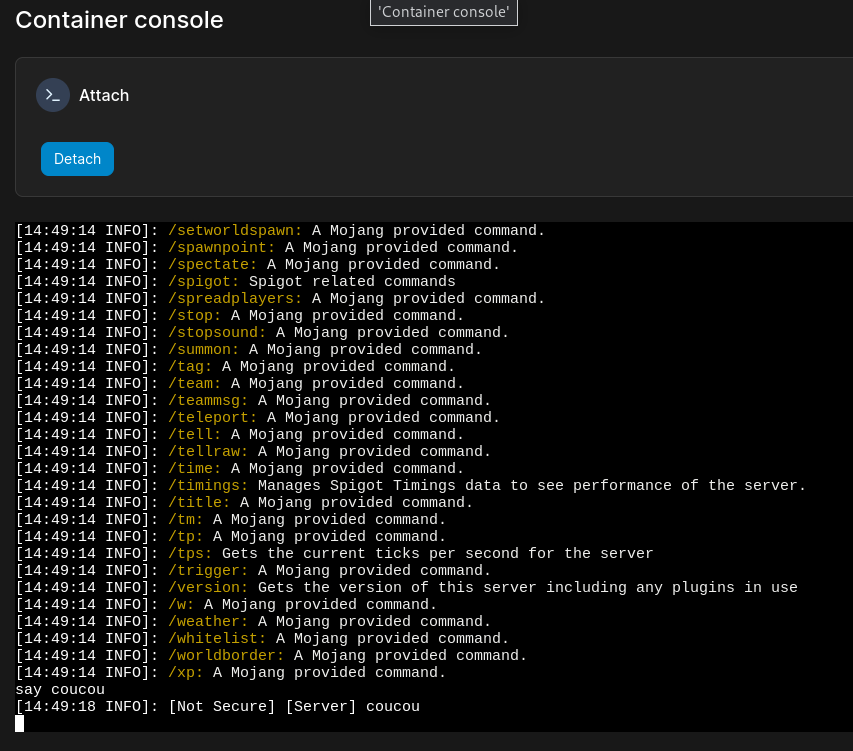
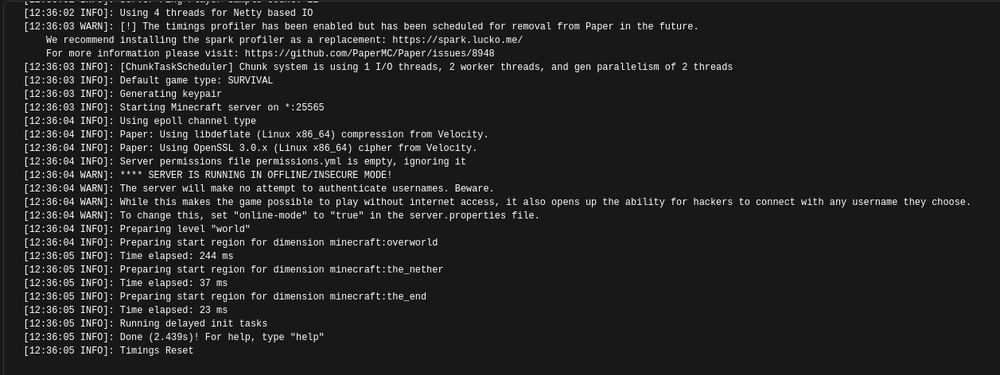

Faire un serveur Minecraft pour jouer avec ses amis, ça doit probablement être l'une des choses les plus faites dans les heures qui suivent l'installation d'un serveur. La bonne nouvelle, c'est que c'est très facile à faire.

Comme prérequis vous aurez notamment besoin d'aller voir les pages dédiées à la [gestion des containers Docker](../40-selfhost/07-docker.md).

Nous allons utiliser l'image Docker [marctv/minecraft-papermc-server](https://hub.docker.com/r/marctv/minecraft-papermc-server) qui contient le serveur Minecraft Paper. L'avantage de Paper, c'est qu'il est ultra optimisé et qu'il permettra donc de faire tourner le container sur quasiment tout, même un Raspberry Pi.

Voici le fichier `docker-compose` que l'on va utiliser pour déployer le serveur.

:::caution
Pensez à utiliser un tag correspondant à une version !
Si vous ne le faites pas, votre serveur sera automatiquement mis à jour vers la version suivante.
Pour éviter les risques de corruption de votre monde, faites un backup **puis** changez la version de votre serveur.
:::

```yaml
---
version: "3"
services:
  serveur-mc:
    # Changez le tag de l'image pour la version que vous voulez
    image: marctv/minecraft-papermc-server:1.20

    container_name: serveur-mc

    # stdin_open et tty pour permettront d'administrer votre
    # serveur via la console interactive, sans nécessiter que
    # vous vous connectiez au jeu pour faire des commandes
    stdin_open: true
    tty: true

    # Les fichiers server.properties et tous les autres seront dans ce dossier
    volumes:
      - /chemin/vers/fichiers:/data

    # Remplacer xxxxx par le port sur lequel le serveur écoutra
    ports:
      - xxxxx:25565

    # Pour être sûr que le serveur redémarre automatiquement
    # en cas de crash ou de reboot de la machine
    restart: unless-stopped
```

:::danger
Si vous ne montez pas de volume pour votre serveur, vous perdrez l'intégralité des données du serveur (y compris votre sauvegarde) !
Pensez à bien monter le dossier.
:::

Une fois le serveur déployé une première fois, les différentes options nous permettent de voir la console Minecraft depuis Portainer :



On peut aussi y voir les logs du serveur en temps réel via l'onglet "Logs" de son container :



Et voilà ! Pour configurer le reste du serveur, vous n'avez qu'à éditer le fichier `server.properties` dans le dossier où vous avez monté vos données !
